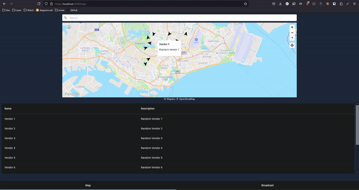

# About
Application that allow mobile trucks to broadcast their locations to user.

These mobile trucks may be food trucks. Alternatively, they may be used to deliver essential items to the elderly, disabled etc.<sup>1</sup> The general idea is to make a single trip
through the locations so save on delivery cost, stopping at common collection points instead of each individual address. 

1 <sub>I have submitted the latter idea (delivery essentials to elderly) to [Build for Good 2024](https://www.build.gov.sg/) but it was rejected.
Regardless, I think it is still an idea worth exploring.</sub>

## Preview
`make start`



## Develop
Install:

```
make install
```

Run the application:
```
make start
```

Test:
```
make test
```

# Code architecture
The folder structure of this project follows the [package by component](https://dzone.com/articles/package-component-and) architecture.


Components should not have any dependency between each other, unless it is through a `shared` component.
